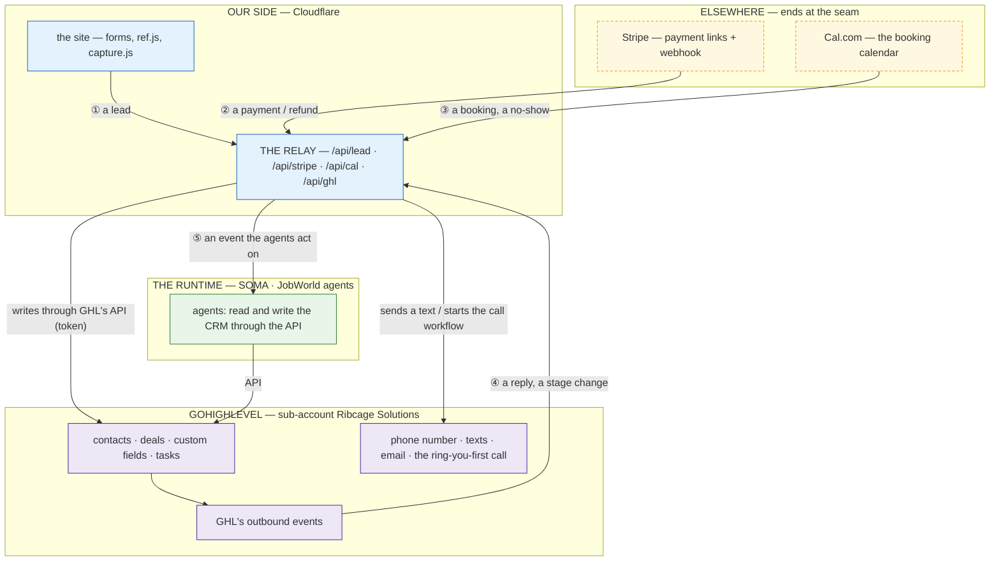

# GoHighLevel — what it gives us, what we keep, and how they connect

REFERENCE DETAIL — READ when anything touches GoHighLevel (GHL), the relay's writes into it, or where a piece of
business logic should live. NOT deprecated, NOT skippable. The law it serves is `.claude/rules/00-SITE-CANON.md`
§ HOSTING AND AUTOMATIONS; the payment side is `docs/stripe-payments.md`; the HOW of the Worker is the
`cloudflare-site` skill; the vendor facts (plans, prices, what the API can do) are the business-runtime project's
`research/ghl.md` (§ WHAT THE API EXPOSES).

**Status:** ① the lead and ② the payment are BUILT (`lib/ghl.js`, called by `functions/api/lead.js` and
`functions/api/stripe.js`) and proven against the real sub-account with test records, which were then deleted. ③ Cal.com
and ④ GHL's outbound events are NOT BUILT. The text to the lead and the ring-you-first call are not built: they wait on
a phone number and the A2P registration. The GHL sub-account is "Ribcage Solutions" (pipeline "TWI Sales", 8 contact
fields); the hand-built workflow "Website Lead Intake" there is not called by anything and can stay off.

## 1. The split — who is responsible for what

| GHL gives us (the CRM and the reach) | We keep ourselves (the brain and the glue) | Comes from elsewhere |
|---|---|---|
| people: contacts, notes, tags, custom fields | the website (Cloudflare Worker + static files) | **Stripe** — the money, the payment links, the payment webhook |
| deals: pipeline "TWI Sales" — New lead → Booked → Showed → Proposal → Won (Lost = a status) | **the relay** — the one server every form and payment passes through | **Cal.com** — today's booking calendar (GHL has its own; which one wins is OPEN) |
| reach: a phone number, texts, calls, email, reminders, missed-call text-back, review requests | partner attribution: `?ref=` code kept 90 days, carried to the contact and to Stripe | **the phone carrier** — through GHL; texting needs the A2P registration |
| the ring-you-first call to a new lead (a workflow step — the one thing with no API) | consent records: what a visitor agreed to, when, which wording (`consent_version`) | **ElevenLabs / YouTube** — the voice and the films |
| calendars, forms, surveys, email sequences | the offer, its prices, its copy — frozen, Isaac's only | **HighLevel affiliate program** — commission on the agencies we refer |
| GHL's own AI chat and voice (a template we can sell) | the agents and the runtime that do the work (SOMA, JobWorld) — GHL is their commodity surface | |
| SaaS Mode — sells a white-label account to a client, creates the sub-account, rebills usage at our markup | commission payouts to partners — by hand, monthly, from a task the relay creates | |
| snapshots — a configured account others can be given | the decisions: what happens when, and why | |

**The rule under it:** the visual builders (workflows, funnels, page layouts) have no write API — GHL's API can
list workflows, never create one. So **anything that must be tested, versioned and changed quickly is code in the
relay; anything that only GHL can do (the ring-you-first call, SaaS billing) is a workflow built once by hand and
started by the relay.**

## 2. The connections — what flows where

| # | event | who sends it | what the relay does | what lands in GHL |
|---|---|---|---|---|
| ① BUILT | a visitor submits a form | the site → `/api/lead` | drops bots and bad emails, labels the lead (form, page, partner), keeps the consent record | **upsert contact** (partner code, form, revenue, focus, page, consent record + version) · **create the deal** at New lead · a note · a task "Call new lead now" for Isaac, due in 2 minutes · *(not built yet: **the text and the ring-you-first call, only if a consent record and a phone are present**)* |
| ② BUILT | a payment or a refund | Stripe → `/api/stripe` (signed, 5-minute window) | reads `payment_id`, `billing_reason`, `ref` | **find the contact by email** (none → a task "unmatched payment") · skip if `last_payment_id` already equals this `payment_id` · save it · **deal → Won** · a partner code present and it is the first payment (`subscription_create` / `checkout`, never `subscription_cycle`) → a task "pay <partner> $1,000" · a refund → a task to cancel an unpaid commission |
| ③ | a call is booked, or missed | Cal.com webhook → `/api/cal` — **NOT BUILT** | maps booking → the contact by email | deal → **Booked**; after the call **Showed**; a no-show starts the no-show follow-up |
| ④ | the lead replies, or a deal moves | GHL's outbound events → `/api/ghl` — **NOT BUILT; whether GHL charges for these is unverified** (`research/ghl.md` Q9) | verifies the call is GHL's, routes it | tells the agents, or updates the site's own records |
| ⑤ | anything the agents should act on | the relay → the runtime | forwards the event | the agents write back through the API |

**The keys that tie the systems together** (a missing key is a broken link, never a guess):

| key | joins | rule |
|---|---|---|
| the contact's **email** | a payer, a booker and a lead are the same person | the only match; no email → a task for Isaac, never a duplicate contact |
| **`payment_id`** | a checkout and its invoice — one sale arrives twice | saved on the contact as `last_payment_id`; a second arrival stops |
| the **partner code** (`ref`) | the lead → the contact → Stripe's `client_reference_id` → the commission | stored on the contact as `partner_code`; empty means no partner |
| the **consent record + version** | a text or a call → the wording the visitor saw | no record, no text and no call |

## 3. What GHL's API can and cannot do (the boundary the design is drawn around)

VERIFIED 2026-09-28 · GHL's official OpenAPI specs (576 operations, 41 areas — full list in `research/ghl.md`).
**Writable:** contacts, notes, tags, tasks (with a full due timestamp), deals and their Won/Lost status, custom
fields, texts and email, phone-number purchase, sub-accounts, SaaS, users, blog posts, media, custom menu links,
redirects. **Not writable:** workflows (list only), funnel and website pages (list only), snapshots (a share link
only — loading one is done in the app). A hand-built workflow can be started for a contact:
`POST /contacts/{contactId}/workflow/{workflowId}`.

## 4. What is needed to build it

| need | who | state |
|---|---|---|
| a Private Integration Token for the sub-account | Isaac created it (all scopes — narrow it to contacts, opportunities, conversations messages, custom fields once things settle); it lives only in the Worker's secret `GHL_TOKEN` and `.dev.vars` | ✅ |
| a phone number in the sub-account | Isaac buys it | ⏸ |
| the A2P registration (IRS CP 575 emailed to GHL's team) | Isaac | ⏸ |
| the ring-you-first call workflow, built once | Isaac by hand, or with GHL's assistant | ⏸ |
| the relay's GHL module (`lib/ghl.js`) + the payment and lead handlers | an agent | ✅ |
| Cal.com → relay | an agent, after the calendar question below | ⏸ |

**Open for Isaac:** keep Cal.com or move booking into GHL's calendar · whether the hand-built workflow "Website
Lead Intake" is switched off once the relay writes to GHL directly.

## 5. Proof and undo

PROOF (done 2026-09-28 against the real sub-account, records deleted after): one lead → a contact with its 7 fields, a deal at New lead, a note and a task; the same sale sent as an invoice then a checkout, twice each → one deal Won at the first payment's amount, one "Pay partner" task; a renewal changed nothing about the deal; a refund → a task; an unknown payer → a contact tagged `unmatched-payment` and a task. UNDO: remove `GHL_TOKEN` from the Worker — the relay falls
back to the webhook destinations it has today.
